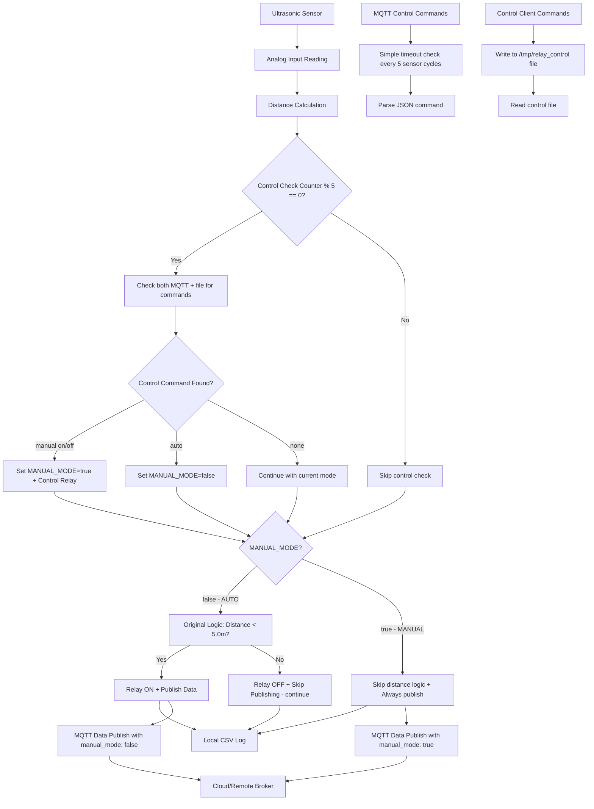

# Maxbotic Ultrasonic Sensor with Simple Remote Control for Raspberry Pi CM4

[](https://opensource.org/licenses/MIT)  
[](https://www.raspberrypi.org/)
[](https://mqtt.org/)

A robust, production-ready solution for interfacing Maxbotic ultrasonic sensors with Raspberry Pi CM4 using analog input. This system provides continuous distance monitoring with real-time data transmission via MQTT protocol, enhanced with **simple 3-command remote control** (ON/OFF/AUTO) while preserving the original elegant working logic.

## 🚀 Features

- **Real-time Distance Monitoring** - Continuous sensor data acquisition every 2 seconds
- **MQTT Integration** - Automatic data publishing to cloud/remote brokers
- **Simple 3-Command Remote Control** - Easy remote switching: ON/OFF/AUTO via MQTT
- **Preserves Original Logic** - AUTO mode maintains exact original behavior and structure
- **Smart Threshold Control** - Automatic relay activation based on distance thresholds (< 5.0m)
- **Three Control Modes** - AUTO (original behavior), Manual ON, Manual OFF
- **JSON Data Format** - Structured sensor data with timestamps and metadata
- **Systemd Service** - Robust background service with automatic startup
- **Local Data Logging** - CSV format with timestamps for offline analysis
- **Minimal Overhead** - Simple periodic control check every 5 sensor readings
- **No Complex Processes** - File-based + simple MQTT timeout approach
- **Error Handling** - Comprehensive error detection and recovery
- **Easy Configuration** - Environment-based MQTT settings

## 📋 Requirements

### Hardware
- Raspberry Pi CM4 (Compute Module 4)
- Maxbotic Ultrasonic Sensor (analog output)
- Relay module connected via Modbus RTU (optional)
- Proper analog input setup on CM4

### Software
- Raspberry Pi OS (Bullseye or newer)
- Internet connection for MQTT transmission

### Dependencies
The installation script will automatically install:
- `mosquitto` - MQTT broker/client
- `mosquitto-clients` - MQTT command-line tools (including mosquitto_sub for remote control)
- `bc` - Mathematical calculations
- `mbpoll` - Modbus polling utility for relay control
- `systemd` - Service management (pre-installed)

## 🔧 Hardware Setup

### Sensor Connection
The ultrasonic sensor should be connected to the analog input interface:

```
Sensor Path: /sys/bus/iio/devices/iio:device0
Raw Data:    cat /sys/bus/iio/devices/iio:device0/in_voltage1_raw
```

### Relay Connection (Optional)
For relay control functionality:
```
Relay Device: /dev/ttyAMA4
Protocol:     Modbus RTU
Baudrate:     9600
Address:      1
```

### Distance Calculation
```
Distance (meters) = (raw_value * 10) / 1303
```

## 📦 Installation

### Quick Start

1. **Clone the repository:**
   ```bash
   git clone https://github.com/hanifr/maxbotic-ultrasonic-rpi-analog-cm4.git
   cd maxbotic-ultrasonic-rpi-analog-cm4
   ```

2. **Run the installation script:**
   ```bash
   chmod +x init.sh
   ./init.sh
   ```

3. **Configure MQTT settings** (see Configuration section below)

4. **Test remote control:**
   ```bash
   ./relay_control_client.sh on    # Turn relay ON
   ./relay_control_client.sh auto  # Back to automatic mode
   ```

### Manual Installation

If you prefer manual installation:

```bash
# Set timezone
sudo timedatectl set-timezone Asia/Kuala_Lumpur

# Install dependencies
sudo apt update
sudo apt install -y mosquitto mosquitto-clients bc mbpoll

# Enable Mosquitto
sudo systemctl enable mosquitto
sudo systemctl start mosquitto

# Configure and run setup
./primary.sh
```

## ⚙️ Configuration

### MQTT Settings

Edit `mqtt_service.sh` to configure your MQTT broker:

```bash
# MQTT Broker Configuration
export MQTT_BROKER="xx.xxx.xxx"
export MQTT_PORT=1883
export MQTT_TOPIC="dtonggang/ultrasonic-01"
export MQTT_CLIENT_ID="cm4-1"

# Optional Authentication
# export MQTT_USERNAME="your_username"
# export MQTT_PASSWORD="your_password"

# Quality of Service (0, 1, or 2)
export MQTT_QOS=2

# Sensor Settings
export MEASUREMENT_INTERVAL=2  # seconds
export OUTPUT_FILE="/home/pi/ultrasonic.txt"
```

### MQTT Topics Structure

The system uses a simple topic structure:

```bash
# Base topic (from MQTT_TOPIC)
dtonggang/ultrasonic-01                    # Sensor data publishing

# Control topic (automatically derived)
dtonggang/ultrasonic-01/control            # Send simple relay commands
```

## 🚀 Usage

### Service Management

```bash
# View real-time logs
sudo journalctl -u maxbotic_ultrasonic -f

# Check service status
sudo systemctl status maxbonic_ultrasonic

# Start/Stop/Restart service
sudo systemctl start maxbotic_ultrasonic
sudo systemctl stop maxbotic_ultrasonic
sudo systemctl restart maxbotic_ultrasonic

# Enable/Disable automatic startup
sudo systemctl enable maxbotic_ultrasonic
sudo systemctl disable maxbotic_ultrasonic
```

### Simple Remote Control

#### Using the Control Client (Recommended)

```bash
# Turn relay ON manually (overrides automatic control)
./relay_control_client.sh on

# Turn relay OFF manually (overrides automatic control)
./relay_control_client.sh off

# Switch back to automatic mode (distance-based control)
./relay_control_client.sh auto
```

#### Using MQTT Commands Directly

```bash
# Turn relay ON manually
mosquitto_pub -h xx.xxx.xxx -t "dtonggang/ultrasonic-01/control" -m '{"relay": "on"}'

# Turn relay OFF manually
mosquitto_pub -h xx.xxx.xxx -t "dtonggang/ultrasonic-01/control" -m '{"relay": "off"}'

# Switch back to automatic mode
mosquitto_pub -h xx.xxx.xxx -t "dtonggang/ultrasonic-01/control" -m '{"mode": "auto"}'
```

#### Control Modes

1. **AUTO Mode** (Default)
   - **Behavior**: Original working logic preserved exactly
   - Relay turns ON when distance < 5.0m
   - Relay turns OFF when distance ≥ 5.0m
   - Publishes sensor data only when relay is ON (distance < 5.0m)
   - Uses `continue` to skip MQTT publishing when above threshold
   - This maintains the exact behavior from your original working script

2. **Manual ON Mode**
   - **Triggered by**: `{"relay": "on"}` command
   - Relay stays ON regardless of distance
   - Always publishes sensor data (shows manual_mode: true)
   - Overrides automatic threshold control

3. **Manual OFF Mode**
   - **Triggered by**: `{"relay": "off"}` command
   - Relay stays OFF regardless of distance
   - Always publishes sensor data (shows manual_mode: true)
   - Overrides automatic threshold control

### Data Format

#### MQTT Sensor Data Payload (JSON)
```json
{
    "distance": 1.234,
    "unit": "meters",
    "timestamp": "2025-08-04T10:30:45.123",
    "sensor_id": "cm4-1",
    "raw_value": 161,
    "manual_mode": false
}
```

#### Local Log File (CSV)
```csv
2025-08-04T10:30:45.123,1.234
2025-08-04T10:30:47.456,1.456
2025-08-04T10:30:49.789,0.987
```

### Manual Testing

```bash
# Test sensor reading
cat /sys/bus/iio/devices/iio:device0/in_voltage1_raw

# Test MQTT connection
mosquitto_pub -h xx.xxx.xxx -p 1883 -t test/topic -m "test message"

# Test relay control (if connected)
mbpoll -m rtu -a 1 -b 9600 -P none -s 1 -t 0 -r 2 /dev/ttyAMA4 -- 1  # ON
mbpoll -m rtu -a 1 -b 9600 -P none -s 1 -t 0 -r 2 /dev/ttyAMA4 -- 0  # OFF

# Check control file
cat /tmp/relay_control 2>/dev/null || echo "No control command active"

# Run sensor script manually
sudo ~/startUltrasonic.sh
```

## 📊 Monitoring & Troubleshooting

### Log Analysis

```bash
# View recent logs
sudo journalctl -u maxbotic_ultrasonic --since "1 hour ago"

# View logs with timestamps
sudo journalctl -u maxbotic_ultrasonic -o short-iso

# Follow logs in real-time
sudo journalctl -u maxbotic_ultrasonic -f

# Filter for relay control messages
sudo journalctl -u maxbotic_ultrasonic -f | grep -i "command\|relay\|manual"
```

### Common Issues

#### Service Won't Start
```bash
# Check service status
sudo systemctl status maxbotic_ultrasonic

# Verify script permissions
ls -la ~/startUltrasonic.sh

# Test script manually
sudo ~/startUltrasonic.sh
```

#### MQTT Connection Issues
```bash
# Test MQTT broker connectivity
mosquitto_pub -h xx.xxx.xxx -p 1883 -t test -m "connectivity test"

# Check network connectivity
ping xx.xxx.xxx

# Verify MQTT configuration
source mqtt_service.sh && validate_mqtt_config
```

#### Remote Control Not Working
```bash
# Test simple control command
./relay_control_client.sh on

# Check if control file is created
ls -la /tmp/relay_control

# Test MQTT command directly
mosquitto_pub -h xx.xxx.xxx -t "dtonggang/ultrasonic-01/control" -m '{"relay": "on"}'

# Check for control messages in logs
sudo journalctl -u maxbotic_ultrasonic -f | grep -i "command\|mqtt"
```

#### Relay Control Issues
```bash
# Check if relay device exists
ls -la /dev/ttyAMA4

# Test manual relay control
mbpoll -m rtu -a 1 -b 9600 -P none -s 1 -t 0 -r 2 /dev/ttyAMA4 -- 1

# Check relay permissions
sudo usermod -a -G dialout $USER  # Add user to dialout group
```

#### Sensor Reading Issues
```bash
# Check if sensor device exists
ls -la /sys/bus/iio/devices/iio:device0/

# Test raw sensor reading
cat /sys/bus/iio/devices/iio:device0/in_voltage1_raw

# Check permissions
ls -la /sys/bus/iio/devices/iio:device0/in_voltage1_raw
```

## 📁 File Structure

```
maxbotic-ultrasonic-rpi-analog-cm4/
├── init.sh                     # Main installation script
├── primary.sh                  # Enhanced service setup script (with simple remote control)
├── mqtt_service.sh             # MQTT configuration
├── README.md                   # This file
├── ~/startUltrasonic.sh        # Generated sensor script (with simple remote control listening)
├── ~/relay_control_client.sh   # Simple 3-command control client (auto-generated)
├── /etc/systemd/system/maxbotic_ultrasonic.service # System service
└── /tmp/relay_control          # Simple control command file (temporary, when active)
```

## 🔄 System Architecture



## 🛠️ Development

### Testing Changes

```bash
# Test configuration changes
source mqtt_service.sh
validate_mqtt_config

# Test script syntax
bash -n primary.sh
bash -n init.sh

# Test service creation without starting
sudo systemctl daemon-reload
sudo systemctl status maxbotic_ultrasonic

# Test simple control flow
./relay_control_client.sh on
cat /tmp/relay_control  # Should show "on"

./relay_control_client.sh auto
ls /tmp/relay_control   # File should be removed or empty
```

### Adding Features

The simple modular design allows easy extension:

- **New sensors**: Modify calculation in `startUltrasonic.sh`
- **Different protocols**: Add to `mqtt_service.sh`
- **Data processing**: Enhance JSON payload structure
- **Alert system**: Add threshold monitoring
- **Multiple relays**: Extend relay control logic
- **Custom thresholds**: Modify the 5.0m threshold in AUTO mode
- **Additional control modes**: Add new commands to control client

## 🎯 Use Cases

### Industrial Automation
- **Tank Level Monitoring**: Automatically control pumps when liquid levels drop below 5.0m
- **Conveyor Control**: Stop/start systems when objects are detected within threshold
- **Safety Systems**: Emergency shutoff when distance thresholds are exceeded

### Smart Building
- **Parking Sensors**: Indicate parking space availability with relay-controlled indicators
- **Door Automation**: Open/close doors based on proximity detection
- **HVAC Control**: Adjust systems based on occupancy detection

### Agricultural Applications
- **Irrigation Control**: Manage water pumps based on water tank levels
- **Feed Systems**: Control dispensing based on container levels
- **Livestock Monitoring**: Track animal presence with relay-controlled systems

### Remote Operations
- **Manual Override**: Remote operators can override automatic systems via simple MQTT commands
- **Emergency Control**: Instantly turn systems ON/OFF regardless of sensor readings
- **Maintenance Mode**: Disable automatic operation during maintenance

## 📄 Example Session

### Installation Output
```
[INFO] Maxbotic Ultrasonic Sensor service setup with simple remote control started
[SUCCESS] All dependencies satisfied
[MQTT-INFO] MQTT configuration validated successfully
[MQTT-INFO] Broker: xx.xxx.xxx:1883
[MQTT-INFO] Topic: dtonggang/ultrasonic-01
[MQTT-INFO] Client ID: cm4-1
[MQTT-INFO] MQTT connection test successful
[SUCCESS] Startup script created at /home/user/startUltrasonic.sh
[SUCCESS] Simple control client created at /home/user/relay_control_client.sh
[SUCCESS] Systemd service created
[SUCCESS] Service enabled successfully
[SUCCESS] Service started successfully
[SUCCESS] Service is running successfully
[SUCCESS] Maxbotic Ultrasonic service with simple remote control setup completed successfully!

=== Simple Remote Control ===
Turn relay ON:       ./relay_control_client.sh on
Turn relay OFF:      ./relay_control_client.sh off
Auto mode:           ./relay_control_client.sh auto

=== Control Modes ===
AUTO:     Original behavior preserved - relay ON when distance < 5.0m, publish only when ON
MANUAL:   Override automatic control - always publish to show manual state
```

### Runtime Logs
```
Mon Aug  4 10:30:45 2025: Distance: 3.245m (published successfully)
Mon Aug  4 10:30:47 2025: Distance: 6.789m (above threshold, not publishing)
Mon Aug  4 10:31:00 2025: MQTT command: Relay ON
Mon Aug  4 10:31:02 2025: Distance: 6.789m (manual mode, published successfully)
Mon Aug  4 10:31:15 2025: MQTT command: Auto mode
Mon Aug  4 10:31:17 2025: Distance: 6.789m (above threshold, not publishing)
```

## 🔧 Advanced Configuration

### Custom Distance Threshold
To modify the 5.0m threshold, edit the startup script after installation:

```bash
# Edit the generated script
sudo nano ~/startUltrasonic.sh

# Find and modify this line in the AUTO mode section:
THRESHOLD=5.0  # Change to your desired threshold
```

### Multiple Sensor Support
For multiple sensors, create separate service instances:

```bash
# Copy configuration for second sensor
cp mqtt_service.sh mqtt_service_02.sh

# Modify topics and settings in the copy
export MQTT_TOPIC="dtonggang/ultrasonic-02"
export MQTT_CLIENT_ID="cm4-2"

# Run primary.sh with different config
MQTT_CONFIG="mqtt_service_02.sh" ./primary.sh
```

### Control Check Frequency
By default, the system checks for remote commands every 5 sensor readings (typically every 10 seconds with 2-second intervals). To modify:

```bash
# Edit the generated script
sudo nano ~/startUltrasonic.sh

# Find and modify this line:
if [[ $((CONTROL_CHECK_COUNTER % 5)) -eq 0 ]]; then  # Change 5 to your desired frequency
```

## 💡 Design Philosophy

This implementation prioritizes **elegance and compatibility** with the original working system:

- **Preserves Original Structure**: Enhanced existing primary.sh without changing its core logic
- **Minimal Integration**: Remote control added with just ~30 lines in the sensor loop
- **Dual-Channel Control**: File-based + MQTT timeout approach for reliability
- **Periodic Checking**: Non-blocking control check every 5 sensor readings (10 seconds)
- **Original Logic Intact**: AUTO mode maintains exact original behavior with `continue` for above-threshold
- **No Background Processes**: Simple, atomic operations without complex state management
- **Easy Troubleshooting**: File-based control state that's easy to inspect and debug
- **Production Ready**: Built on proven original working logic with minimal modifications

### Key Benefits Over Complex Solutions
- **Maintainable**: Easy to understand, debug, and modify
- **Reliable**: Based on proven original working code
- **Lightweight**: No additional processes or complex IPC mechanisms  
- **Compatible**: Existing installations can be easily upgraded
- **Elegant**: Sophisticated functionality through simple, well-designed additions

## 🤝 Contributing

1. Fork the repository
2. Create a feature branch (`git checkout -b feature/amazing-feature`)
3. Commit your changes (`git commit -m 'Add amazing feature'`)
4. Push to the branch (`git push origin feature/amazing-feature`)
5. Open a Pull Request

## 📝 License

This project is licensed under the MIT License - see the [LICENSE](LICENSE) file for details.

## 🙏 Acknowledgments

- Maxbotic Inc. for ultrasonic sensor documentation
- Raspberry Pi Foundation for CM4 specifications
- Eclipse Mosquitto project for MQTT implementation
- Modbus community for relay control protocols

## 📞 Support

- **Issues**: [GitHub Issues](https://github.com/hanifr/maxbotic-ultrasonic-rpi-analog-cm4/issues)
- **Documentation**: This README and inline code comments
- **Community**: Feel free to open discussions for questions

---

⭐ **Star this repository if it helped you!**